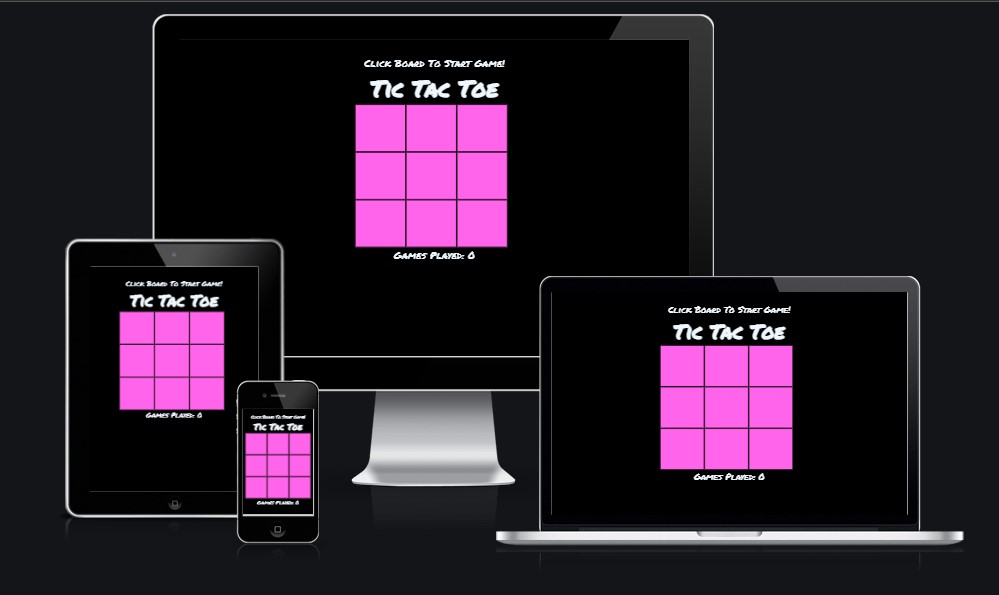
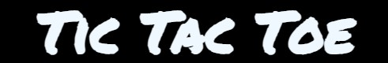
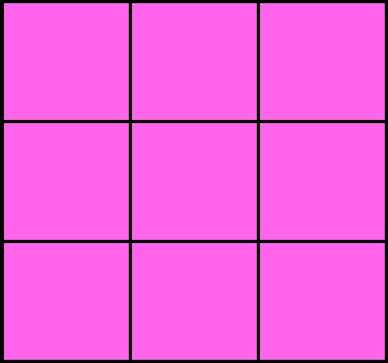
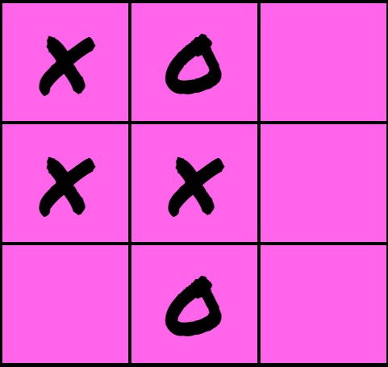

# Tic Tac Toe

This is a website containing a two player tic tac toe game for kids who only have one device to play on.

## Features

### Existing features 

- __A message encouraging the players to click the board to get the game started.__

  - The message dissappares once the game is started.

- __A heading Containging the name of the game.__

  

   - The heading will change based on the outcome of the game.

   - If player X wins, the heading will show that player X has won the game.

   

   - If player O wins, the heading will show that player O has won the game.

   

   - If no one wins, the heading will show that the game is a draw.

   

- __Game board__ 

  - A board with 9 clickable boxes.

  
    
    - First player to click a box is player X.

    - Second player to click a box is player O.

    - The X's and O's look like they have been drawn with a marker.

  

- __Games played__

 - A section for keeping track of how many games have been played.

   

- __Restart message__ 

 - When the game is over a message telling the users to click the board to restart the game pops up.

   - when the game is restarted the message goes away.

   

### Features left to implement 

- __Single player mode__

  - A single player mode where one user can play against an AI.

## Testing 

- I have tested the website on different devices including desktop, laptop and different mobile phones.

- I have tested and confirmed that the website works as intended on different browser.
   - Chrome, Firefox and Microsoft Edge.

### Validator testing

- HTML

  - No errors returned when passing through the official W3C validator

- CSS

  - No errors were found when passing through the official (Jigsaw) validator

- JavaScript

  - No errors were found when passing through the official Jshint validator
    - There are 15 functions in this file.
    - Function with the largest signature take 2 arguments, while the median is 0.
    - Largest function has 10 statements in it, while the median is 2.
    - The most complex function has a cyclomatic complexity value of 5 while the median is 1.

### Accessibility testing 

- Lighthouse
  - I have confirmed that the accessibility score is high by running a lighthouse test

### Unfixed bugs

- Having a problem with a bug sometimes causing the games played section to be incremented twice.

- Only seems to happen when someone wins but not when the game is tied.

- Could at this moment not find the problem so i have left the bug unfixed.

## Deployment

- The site was deployed to GitHub pages. The steps to deploy are as follows: 
  - Go to the websites repository on GitHub
  - In the GitHub repository navigate to the settings tab
  - In the options, menu go to pages
  - From the source section drop-down menu, select the main then click save

- The live link can be found here: https://gurmali.github.io/Tic-Tac-Toe/

## Credits

- I have used different Video and text tutorials to see how other people went about creating a Tic Tac Toe game.